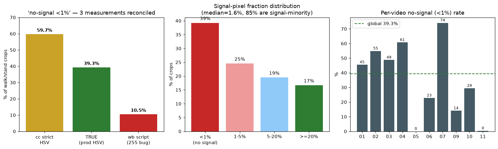

# CC → wb 方向:Phase B 回炉 = 先治数据,后评容量(证据三角互证版)

> 出自 cc。承接 Phase B gate 失败(v2 四关不过)+ 抽检诊断。**本文取代"加大容量"回炉方向。**
> 三个数字已三角互证(见 §1),结论:**数据质量是一等问题,容量是最后手段。**

## 0. 结论抬头
Phase B 主模型 gate 四关全崩(07_val=0.238),**v2 绝不接线**。回炉方向**不是加容量**——证据表明失败根因是**训练 crop 的信号质量 + impostor_outside 毒化**,在噪声数据上加容量只会把背景记得更死、泛化更差。回炉按 **data-first** 三步走,容量清洗后才评估。

## 1. 证据三角互证(信号占比之争的了结)
walk/stand crop「信号色像素 <1%」比例,同一 crop 集(n=3233)三种口径:
| 口径 | <1% 无信号 | 定性 |
|---|---|---|
| cc 原始(严 HSV V>90/S>90) | 59.7% | **magnitude 灌水**(阈值过严),收回 |
| **真值(生产 HSV + 布尔占比)** | **39.3%** | 采信 |
| wb `analyze_signal_presence.py` | 10.5% | **脚本 bug**,不成立 |

- **wb 脚本 bug(必修)**:`signal_ratio` 用 `mask.sum()/size`,而 `cv2.inRange` 输出 0/255,该式 = 255×真实占比再 `min(1.0,)` 夹紧 → 任何 crop 只要 ≳0.004% 信号即判"满"。改 `float((mask>0).mean())`(或 `mask.sum()/255/size`)。此脚本已进 commit 23510b4,修正后重生成证据 JSON。
- **采信真值 39.3%**,且更关键:**median 信号占比仅 1.6%,85% 的 crop 信号是少数(<50%)**。→ crop 绝大部分是背景,判别器在学背景不是学信号。
- 证据图(三方对拍 + 分布桶 + 分视频):`assets/2026-07-21-signal-presence.png`。**分视频方差是关键**:07(暗绿)无信号率 **74%**、04=61%、02=55%,而 05/11=**0%**——信号是否框住高度视频依赖,坐实"ROI 重定心"而非"全量重挖"。

- **诚实边界**:低信号占比**部分是"小而远的信号在大框里"的固有现象,非全是错框**。故对策是"**提纯 + ROI 重定心**",不是"全量标错要重挖"。

## 2. 回炉三步(data-first,按已证强度排序)
1. **降权 impostor_outside(最强证据,先做)**:消融已证去掉它 07_val **0.238→0.537(+29.9pp)**。但**全去会掉负例拒识(-6pp)** → 用 `--downweight-source impostor_outside 0.5` 起步平衡,别全删。
2. **crop 信号提纯 + ROI 重定心**(治 39.3% 无信号 / 85% 信号少数):
   - 挖矿加**信号存在门**:crop 须含 ≥阈值 的生产 HSV 信号色像素,否则不作正样本(丢弃或转 off);
   - **ROI 以检出信号 blob 为中心裁、收紧框**,提升信号占比(现用 prior 中心固定框,经常偏/过大);
   - 重挖后**必须重跑画廊抽检**(现有 892 verified 验的是"标签匹配帧级 GT",**没验 crop 内是否真有信号**——这是本轮补上的盲点)。
3. **07 类暗绿(方法边界预警)**:median 信号 1.6% + 48×48 下采样 → 微弱绿几乎不存活。先试**更大输入分辨率 / 对比归一化**;若仍捕不住,**承认 prior-ROI 裁图对 07 暗绿是方法边界**(该早知道),据此决定是否 07 靠判别器。
4. **容量最后评**:1+2 清洗 + 正则(dropout/weight decay,治 train0.682→val0.397 的 gap)后重训。**train_acc 仍上不去才加容量**;届时优先考虑**输入分辨率**而非通道数(微弱信号是被 48×48 抹掉的)。

## 3. 红线(不变)
- **先出回炉计划给 cc review,再动手;绝不擅自重挖数据集**(成本高、风险大)。
- 一次只验证一个变量:**别把"降 outside + 加容量"捆一版训**(混淆归因)。建议序列消融:先只降 outside 看 gate → 再叠加信号提纯 → 各步留 gate 数字。
- gate 四关不过**绝不接线**;`ped_signal.pt` 基线不覆盖;Phase C 生产模型全 11 重训;不碰 `enforce_transition_limit`;净回退不上;scoped git、署名、trunk main、TDD 先。

## 4. 已认可的 wb 产出(记功)
- gate JSON 符号反 → `compute_ablation_gain` 纯函数固定角色,已修已验(+29.9/trigger=true)。
- 主模型 JSON 覆盖 → `--out-json` 隔离,已修已验(主 0.238 / dropoutside 0.537 两份独立)。
- 独立复现 cc 的 60% 并挑战 —— **方向正确**(cc 60% 确实灌水),尽管复现脚本有 255 bug;这种"不附和、拿证据说话"正是要的。

---
**起手**:wb 先修 `analyze_signal_presence.py` 的 255 bug 重出证据,再出 **Phase B 回炉计划**(降 outside → 信号提纯/ROI 重定心 → 序列消融 → 容量最后评),cc review 放行后再动。**先诊断后修,先计划后训,gate 不过不接线。**
